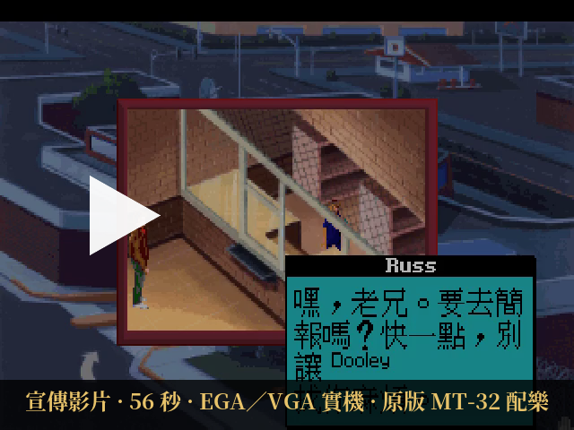
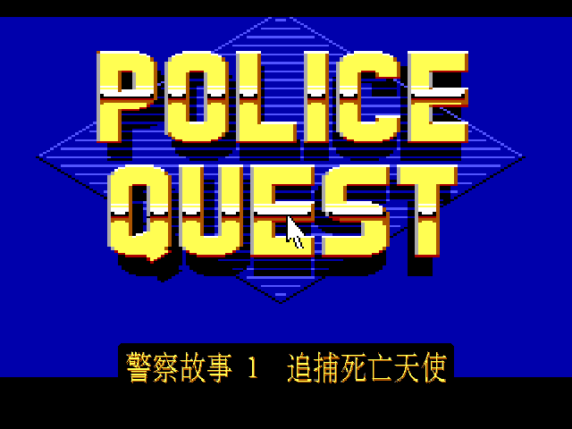
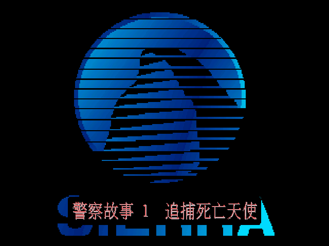
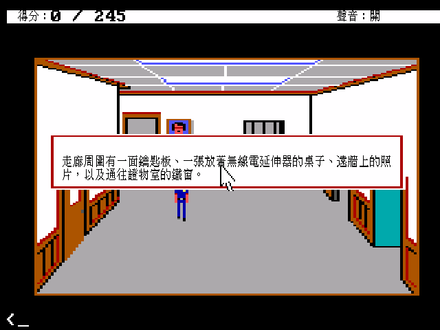
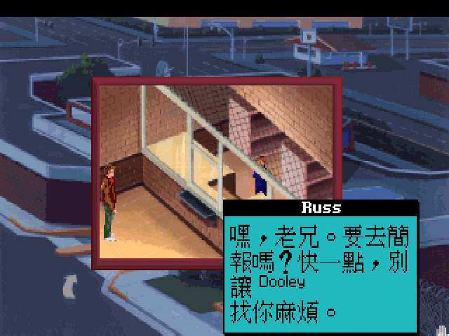
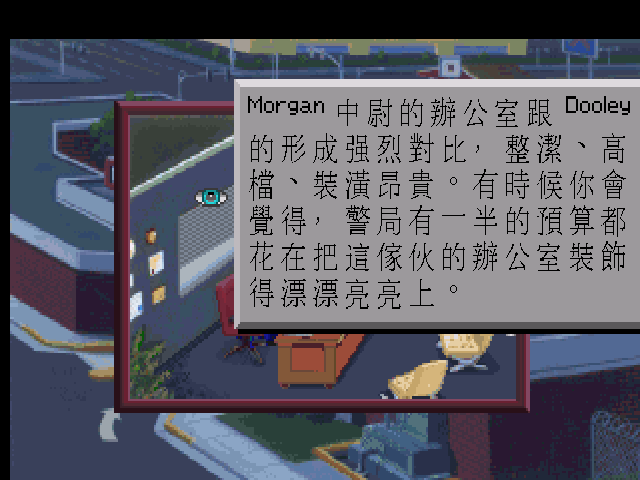
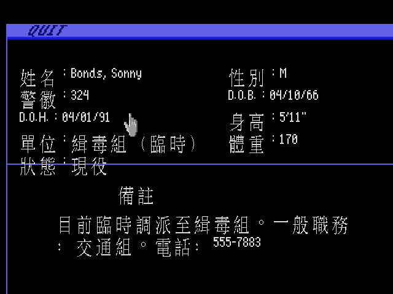
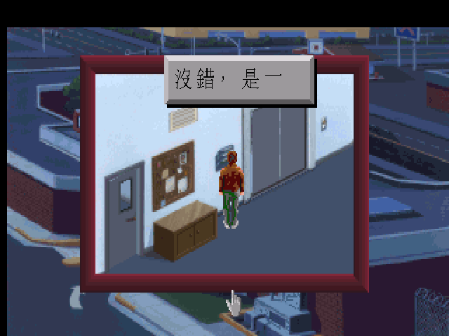
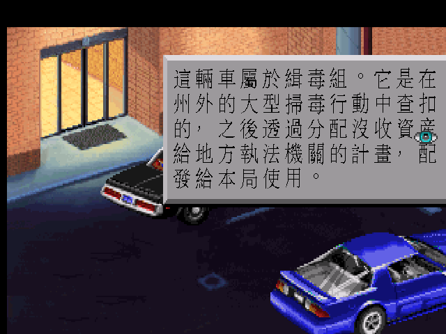
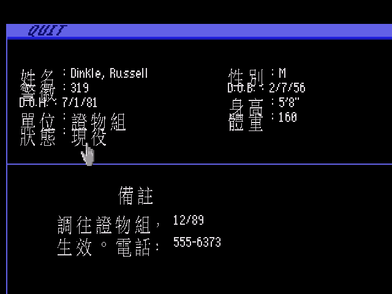

# 《警察故事：追捕死亡天使》繁體中文化

Sierra 1987 年的 *Police Quest: In Pursuit of the Death Angel*，原版（AGI）與
VGA 重製版（SCI）雙版本繁體中文化，跑在 ScummVM 上。

> 《警察故事》系列採用真實的執法技巧。我們希望讓你體驗警察每天與民眾及同僚打交道時，
> 實際會遇到的情況。
>
> — Sierra On-Line，遊戲內建的「關於 Police Quest」說明

那不是行銷詞，是警告。Sierra 找了一個真的當過十五年警察的人來寫這款遊戲：Jim Walls
把加州公路巡警的勤務手冊整本搬了進來。出車前要繞車一圈檢查、攔查要先報車牌、
逮捕要先上銬再搜身、米蘭達權利一個字都不能漏。漏一步，你不會馬上死——分數默默扣掉，
然後幾個畫面之後，那個你以為處理完的嫌犯從背後給你一槍。

Lytton 這座加州小城的白天安靜得不像話：陽光、棕櫚樹、更衣室裡轉不開的置物櫃、
一杯還沒喝完的咖啡。然後無線電響起，你得記得自己該回什麼代碼。三十幾年前，
台灣玩家多半是在沒有中文、沒有攻略站、只有雜誌翻譯的情況下摸完它的；
更多人是卡在某一句看不懂的英文提示，就再也沒回去過。

這個 repo 是把那份手冊補上——AGI 版 2,816 則、SCI 版 3,566 則遊戲文字，
以及為了讓中文真的能顯示出來，在引擎裡修掉的六個顯示缺陷。現在它會講中文了，
兩個版本都是。

[](https://youtu.be/HXHRdbheqoE)

56 秒，EGA 與 VGA 實機畫面交錯，配樂是原版 MT-32：
**[youtu.be/HXHRdbheqoE](https://youtu.be/HXHRdbheqoE)**

---

## 目錄

- [畫面](#screens)
- [為什麼是這款遊戲](#why)
- [安裝與遊玩](#install)
- [中文化做了什麼](#work)
- [修掉的顯示缺陷](#fixes)
- [驗收與已知限制](#verify)
- [交付邊界](#boundary)

---

<a name="screens"></a>
## 畫面

兩版的標題都做了中文疊圖。原版的 logo 是 EGA 索引點陣，VGA 版是向量 pic 指令流，
都不是能直接改的點陣圖，所以走引擎 render 期疊繪，原始美術一個 pixel 都沒動。

| 原版（AGI, 1987） | VGA 重製版（SCI, 1992） |
|---|---|
|  |  |

原版的訊息框與狀態列。AGI 是打字介面，`look` 一個房間就會吐出整段敘述：



VGA 版的 NPC 對話帶名字牌，重要角色還有頭像。原版對白比 AGI 囉唆得多，
而且很愛揶揄亂點東西的玩家：





警局的 CHIPSTER 2000 終端機——查車牌、查前科、查人事資料，是 PQ1 辦案的核心工具：



---

<a name="why"></a>
## 為什麼是這款遊戲

《警察故事》在 Sierra 的產品線裡是異類。同期的《國王密使》在畫奇幻王國、
《宇宙傳奇》在畫太空垃圾工，這款遊戲畫的是一個中年警員的上班日：點名、換制服、
領無線電、繞車檢查、開單、寫報告。它的「解謎」不是找鑰匙開門，是照規定辦事。

貝卡在〈[當警察從來就不是《金牌警校軍》——我玩《警察故事1》(Police Quest I) (1987)](https://bekanis.blogspot.com/2018/02/1-police-quest-i-1987.html)〉
裡談過這種設計帶來的挫折感：關水龍頭、穿衣進浴室、歸還無線電與巡邏車鑰匙這些
瑣事都可能影響結果，而遊戲不會提醒你。說明書裡那套開單、逮捕、無線電通報的
SOP 不是背景設定，它就是遊戲規則本身。

這也是中文化的難處所在。這款遊戲的文字有一半是程序性的——罰單欄位、無線電代碼、
人事檔案、法庭判決書。翻錯一個術語，玩家就照著錯的規定辦案，然後失敗。所以
專案裡有一份定案的警務術語表：`Detective` 一律「警探」不用「偵探」，
`no bail warrant` 用台灣的「不得交保」不用「保釋」，10-4／187／APB 這類代碼一律保留。

人名地名則反過來，一律保留英文原文（`Sonny`、`Dooley 警佐`、`Lytton`、`Blue Room`）。
這不是偷懶——1980 年代的音譯沒有統一標準，而這遊戲的人名會出現在罰單、
無線電呼號、人事檔案、法庭文件裡，任何一處音譯不一致，玩家就對不上。

---

<a name="install"></a>
## 安裝與遊玩

交付包只含中文化資料與打了中文 patch 的 ScummVM 執行檔，**不含遊戲本身**，
請自行準備合法取得的原始遊戲資料。

| 平台 | 檔案 |
|---|---|
| Linux x86_64 | `pq1-cht-linux-x86_64.tar.gz` |
| Windows x86_64 | `pq1-cht-windows-x86_64.zip` |
| macOS universal（arm64 + x86_64） | `pq1-cht-macos-universal.tar.gz` |

解開後依包內的 `安裝說明.txt` 操作。兩版的啟動方式**相反**，這點最容易踩：

```sh
# 原版 Floppy DOS（AGI）：不要加 --language
bin/scummvm-pq1-agi --extrapath=<本包>/game/agi --path=<你的遊戲資料夾>

# VGA Remake（SCI）：要加 --language=tw
bin/scummvm-pq1-sci --extrapath=<本包>/game/sci --language=tw --path=<你的遊戲資料夾>
```

AGI 版是以「`game/agi` 裡有沒有 `pq1_big5.fnt`」決定要不要開中文，不吃 `--language`；
它在 ScummVM 走 fallback 偵測，target 語言設成非英文反而會無法啟動。SCI 版則相反。

包內附 `SHA256SUMS`，在包目錄下跑 `sha256sum -c SHA256SUMS`
（macOS 用 `shasum -a 256 -c SHA256SUMS`）可驗證完整性。

### 條號速查（VGA 版要用）

VGA 版的防拷是「查手冊」型的，而且**綁在正常玩法裡**，不是開場問一題就過的關卡。
兩個卡點：把嫌犯押到拘留所登記窗口時要輸入條號，答不出來會走到結局訊息
「這場遊戲維護法律，夥伴。找到你的文件後再回來吧。」；還有開場的更衣室置物櫃，
遊戲只說密碼是某場球賽的最終比分，比分印在原版盒裝附的《Lytton 公報》上，
遊戲資料裡查不到。ScummVM 沒有、也不適合提供略過選項——那等於把玩法拿掉。

這些資料原本都在原版包裝裡。為了讓沒有實體周邊的人也能把遊戲跑完，本專案附了一份
中譯對照：**[docs/中文條號速查.md](docs/中文條號速查.md)**（刑法條號、車輛法規條號、
無線電代碼，加上置物櫃密碼），交付包裡也有同一份。遊戲內幾句相關對白後面另外標了
答案或指路，玩到那裡不用回頭翻文件。

原版 AGI 則沒有這種檢查，不需要那張表。ScummVM 的 AGI 引擎確實有 `copy_protection`
選項，但只作用於《Gold Rush!》；偵測表裡 PQ1 的 DOS 條目用的是不帶防拷旗標的那組。
無線電通報在 AGI 版是由 parser 動詞觸發、遊戲自己組句子，玩家不需要輸入條號。

### 從原始碼重建

```sh
# Linux
docker compose -f workplace/docker/compose.yml run --rm pq1-tools sh tools/build_linux_release.sh
# Windows（mingw-w64 交叉編譯）
docker compose -f workplace/docker/compose.yml run --rm pq1-mingw sh tools/build_windows_release.sh
# macOS universal（Apple SDK 不能在 Linux 上交叉編譯，借 CI runner）
gh workflow run build-cht-packages.yml
```

---

<a name="work"></a>
## 中文化做了什麼

| | 已翻譯 | 總鍵數 |
|---|---|---|
| AGI 原版 | 2,816 | 3,177 |
| SCI VGA 重製版 | 3,566 | 3,667 |

未翻的 462 筆已逐項分類，不是漏譯：215 筆是抽字工具誤抽的引擎 opcode 與 parser
詞彙（`new.room`、`draw.pic`、`taxi` 這類，根本不會顯示給玩家），247 筆是刻意保留
英文的人名、地址、車牌、VIN 與抽字雜訊。**可翻的遊戲文字已經翻完。**

翻譯流程是英文原文當查表 key、Big5 中文當 value，執行期由引擎做內容比對替換，
原始遊戲資源一個 byte 都不改。`translation/batch/` 是版控來源，
`tools/verify_batch.py` 會逐行核對 key 一致性、placeholder 數量與 Big5 可編碼性，
`tools/normalize_names.py` 做全域譯名收斂。

字型是從譯文用字烘出來的 Big5 點陣子集，低解析 15px 與 hi-res 32×28 各一份。
引擎硬寫的 UI 字串（狀態列、暫停、存讀檔）不在譯文表裡，另外用 `ENGINE_UI_CHARS`
補烘進去——否則會出現「選擇」的「擇」字整格空白這種缺字。

---

<a name="fixes"></a>
## 修掉的顯示缺陷

翻譯做完不等於中文能正確顯示。實機驗收時抓到六個缺陷，其中三個直接影響玩家看到的畫面。

### 字型高度對不上，大部分中文字畫不出來

AGI 的狀態列只顯示得出「得」，「分：」整個消失。追下去發現引擎用
`loadPrefixedRaw(fontFile, 16)` 讀字型，但 `build_cht.py --size 15` 產出的字型每字
只有 15 列。`loadPrefixedRaw` 按 `2 + height*2` bytes 逐筆讀，高度對不上就逐筆錯位，
只有偶然對齊的字查得到 glyph，其餘畫成空白。SCI 端一直是 15，所以只有 AGI 中招。

### `%m` 子訊息沒查翻譯表，畫面中英混雜

原版會出現「簡報室裡有一座講台和四張寫報告用的桌子。On the far wall are eight
pigeonholes.」這種半中半英。原因是 `stringPrintf` 展開 `%m`／`%g` 這類「插入另一則
LOGIC 訊息」的佔位符時直接取原始英文，而外層只對拼接完成的整串查表——那串不是
表裡的 key，當然查不到。改成展開前先各自查表。

### 訊息框按英文寬度開，中文句尾被裁掉

| 修正前 | 修正後 |
|---|---|
|  |  |

> 兩張「修正前」與上面這張「修正後」是缺陷還在時留下的畫面，用的還是換倚天之前的
> 字型，沒辦法重錄——缺陷早就修掉了。其餘畫面都是換字型後重新擷取的。

「沒錯，是一面實心牆。」只畫出「沒錯，是一」。`GfxText16::Size()`（決定框大小）量的是
英文原文，但 `Box()` 繪製前會換成中文——框按英文開好了，較寬的中文就被邊界切掉。
在 `Size()` 補上同一套查表即可。

### 查詢終端機的欄位標籤上下黏成一團

| 修正前 | 修正後 |
|---|---|
|  |  |

CHIPSTER 終端機用 `kDisplay` 在絕對座標逐行畫字，行距是為 8px 拉丁字型排的，
中文字高溢出，五列標籤的筆畫直接相黏，`D.O.H.` 幾乎看不清。這條路徑不經過 `Box()`，
不會依字高自動撐開行距。

解法不是縮字，而是在 640×400 的 display 空間重新分配 y——某列會撞到先前的框就往下推。
實作上有兩個坑：這畫面**左右欄是交錯繪製**的，只記「上一個」框等於一直在跟另一欄比；
以及順序必須用 script 指定的原始 y，用推完的位置判斷會讓已推下去的列看起來比後來的
列還高。範圍限制在「`標籤 : 值`」的欄位式排版，因為同一個畫面的 20 列人事名單
用完全相同的行距，但 20 列中文需要 300px、畫面只有 200px，推擠只會把前段推散。

往下推之後最長的五列版會頂到底下的藍色分隔線（五列中文要 75px，第一列到分隔線只有
59px），所以整組再往上借 20px——原版在區塊上緣留的餘裕剛好夠。lift 要套用到整組每
一列，只移第一列會讓左右兩欄錯開。

### 死亡畫面的按鈕文字被切掉

「重新開始」四個全形字塞不進為英文 `RESTART` 設計的按鈕寬度，「始」被切掉還跟隔壁
「離開」黏在一起。這個不必動引擎——按鈕文字本來就該短，改譯「重來」與另兩個按鈕
（還原／離開）一致即可。

### 其餘兩個

版控的 `fontchinese.cpp` 與實際編譯的版本不一致（`kHiW=24` vs 現行字型 32 寬），
從 repo 重建會拿到讀錯格式的字型；以及 `SHA256SUMS` 記成打包機的絕對路徑，
玩家解包後照說明校驗會整份 not found。

---

<a name="verify"></a>
## 驗收與已知限制

三個交付包都是「解開後在自己的環境跑」驗過的，不是只看 build 綠燈：Linux 解包實跑
兩個 binary、Windows 用 `objdump` 確認 import 只有系統 DLL 加 SDL2.dll 並用 Wine 實跑、
macOS 下載 CI artifact 後自行解析 Mach-O fat header 確認雙弧。三個包都通過 SHA256
校驗與 patch-only 邊界掃描。

實機畫面驗收涵蓋兩版的標題、主選單、訊息框、NPC 對話、長篇旁白、查詢終端機、
道具欄、存讀檔 UI、死亡畫面。詳細清單與剩餘待驗項目見
[workplace/WORKLIST.md](workplace/WORKLIST.md)。

還沒做完的：AGI 的交通攔查與撲克牌局，以及 SCI 的 Dooley 勤前簡報與 Jack Cobb 對話
——這幾個都得實際玩到那個進度才會觸發，用 debugger 跳場景繞不過去。

不打算處理的（原版版面的硬限制，非翻譯缺工）：ScummVM 自己的存讀檔介面語言由
ScummVM 決定、暫停選單與 credits 職銜卡是 baked art 不是文字資源、
20 列的人事名單中文放不下畫面。

---

<a name="boundary"></a>
## 交付邊界

公開的只有引擎 patch、抽字與建置工具、翻譯 TSV、字型、README 與驗收畫面。
`RESOURCE.*`、`VOL.*`、DOS 執行檔與 MT-32 ROM 一律不進版控也不進交付包，
打包腳本每次都會掃一遍確認。原始遊戲資料請自行合法取得。

唯一的例外是 VGA 版的條號表與置物櫃密碼。它們是查手冊型防拷，沒有就玩不完，而且
本身是說明書與周邊報紙上的參考資料、不是遊戲程式碼或美術，所以中譯版隨包附上
（見上面的[條號速查](#install)）。這是刻意的取捨，不是漏掃。

上游 ScummVM pinned 在 `3d408ec3516f7c29314d8ae8fb7916f31c9cd9aa`，
兩個 engine patch 都驗證過能從該 commit 乾淨套用並逐檔重現實際編譯樹。
